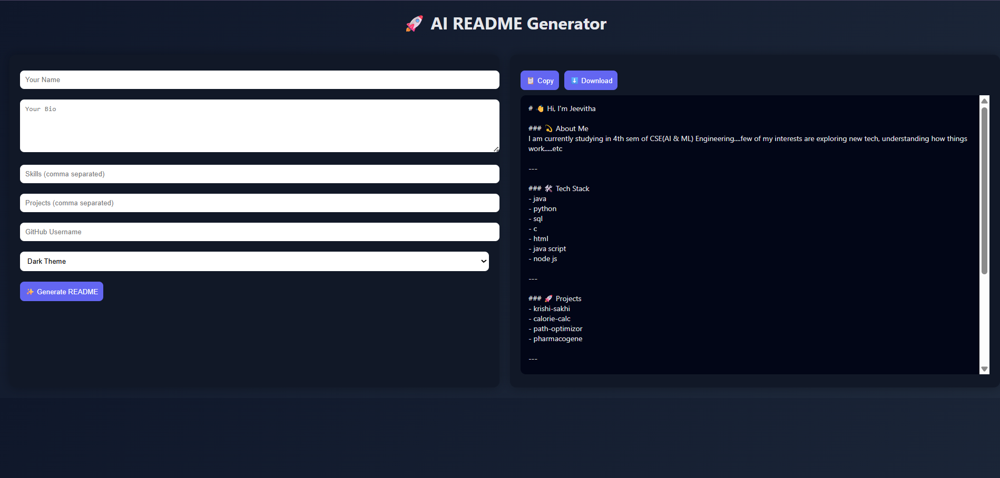

# 🚀 AI README Generator

An interactive web application that helps you generate clean, professional GitHub README files in seconds.

---

## ✨ Features

* 🌐 Simple and intuitive web interface
* 👀 Live preview of generated README
* 📋 Copy to clipboard functionality
* ⬇️ Download README as `.md` file
* 🎨 Theme support (dark/light)
* 📊 GitHub stats integration

---

## 📸 Demo



---

## 🛠️ Tech Stack

* Python
* Flask
* HTML
* CSS
* JavaScript

---

## 📂 Project Structure

```
ai-readme-generator/
 ├── app.py
 ├── templates.py
 ├── requirements.txt
 ├── templates/
 │     └── index.html
 ├── screenshot.png
 └── README.md
```

---

## ▶️ How to Run Locally

1. Clone the repository

```
git clone https://github.com/jeevithab02/ai-readme-generator.git
```

2. Navigate to the project folder

```
cd ai-readme-generator
```

3. Install dependencies

```
pip install -r requirements.txt
```

4. Run the app

```
python app.py
```

5. Open in browser

```
http://127.0.0.1:5000/
```

---

## 🚀 Future Improvements

* 🤖 AI-based content suggestions
* 🎨 More README templates
* 🌍 Deploy as a live web app
* 🔗 Direct GitHub integration

---

## 🤝 Contributing

Contributions are welcome! Feel free to fork the repo and submit a pull request.

---

## ⭐ Support

If you found this project useful, consider giving it a ⭐ on GitHub!

---
